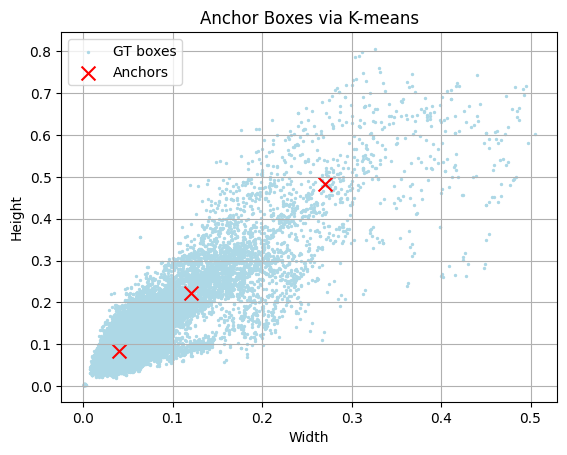
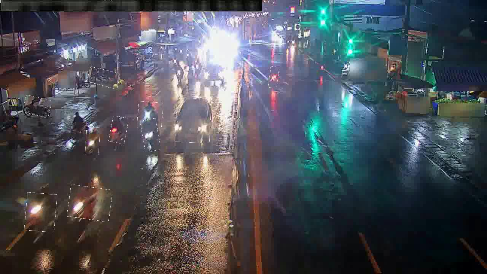
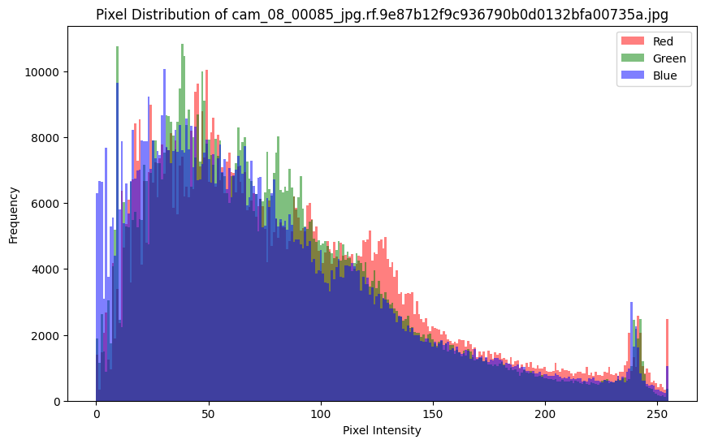
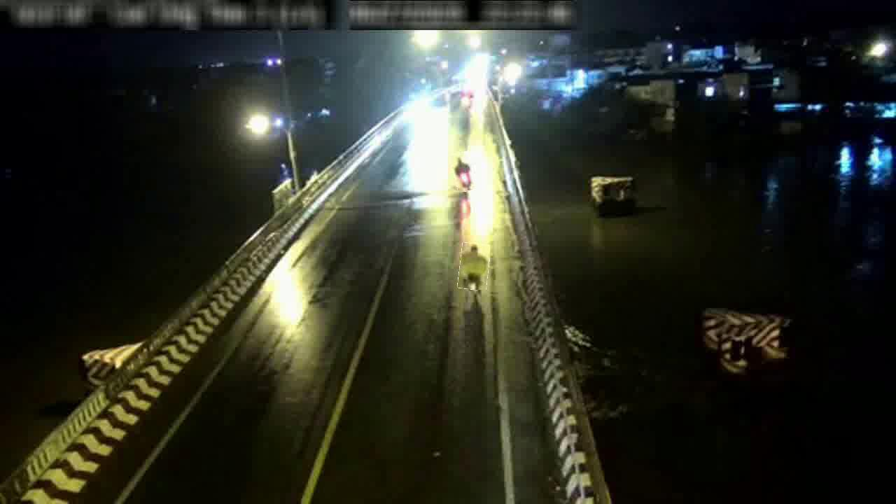
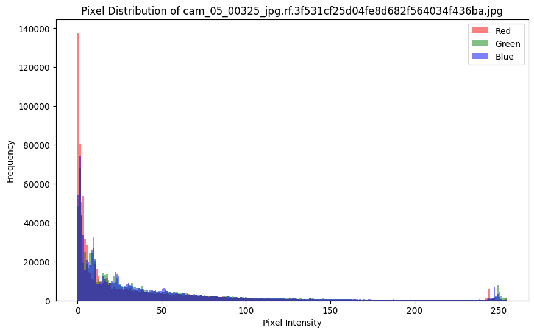
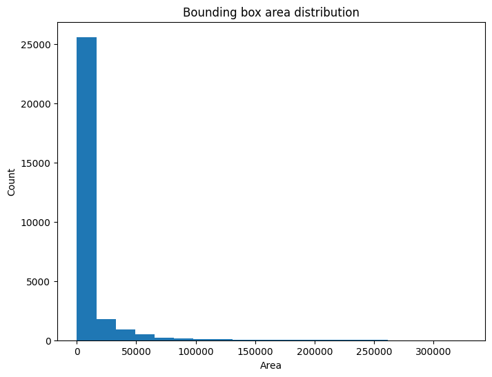
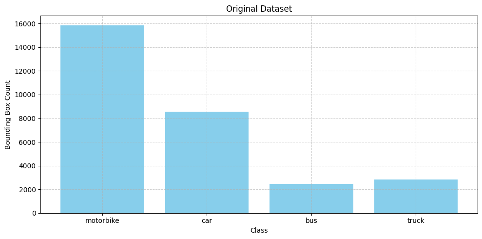

# 🚀 Tracking Objects in Low-Light Conditions

Tracking objects in low-light conditions presents significant challenges due to poor image quality, noise, and reduced contrast, which severely affect the performance of traditional object tracking algorithms. 

To address these issues, I explored a variety of techniques such as denoising, low-light enhancement, and synthetic data generation to improve the quality and robustness of object tracking in dark environments.

---

## ⚠️ Challenges

### 🧊 Diversity in Bounding Box Sizes

    

---

### 🎯 Dense Object Counts in Low-Quality Conditions  
Conditions such as darkness, motion blur, and low contrast make tracking multiple objects particularly difficult.

    

    

---

### 🐜 Small or Oversized Objects in Darkness  
Objects with extreme sizes are harder to detect and track, especially under low-light conditions.

    

    

    

---

### ⚖️ Data Imbalance  
The dataset suffers from label imbalance, which can bias the model toward over-represented classes.

    

---

## 🛠️ Techniques

### 🎨 Data Augmentation
To enhance model robustness, I applied the following augmentations:

- ✅ `CLAHE(p=0.5)`
- ✅ `RandomBrightnessContrast(p=0.4)`
- ✅ `HueSaturationValue(p=0.3)`
- ✅ `MotionBlur(blur_limit=5, p=0.3)`
- ✅ `GaussNoise(var_limit=(10.0, 30.0), p=0.2)`
- ✅ `HorizontalFlip(p=0.5)`
- ✅ `Rotate(limit=20, border_mode=cv2.BORDER_CONSTANT, p=0.4)`
- ✅ `RandomResizedCrop(size=(img_size, img_size), scale=(0.95, 1.0), p=0.5)`
- ✅ `Resize(img_size, img_size)`

---

### 🔁 Upsampling for Imbalanced Classes  
To address class imbalance, for each under-represented class:

> I created a folder containing 100 images of that class. During dataset preparation, one image is randomly selected from this folder and pasted onto other images to increase the number of samples for that label.

---

## 🧠 Model

---

## 📁 Repository Structure

